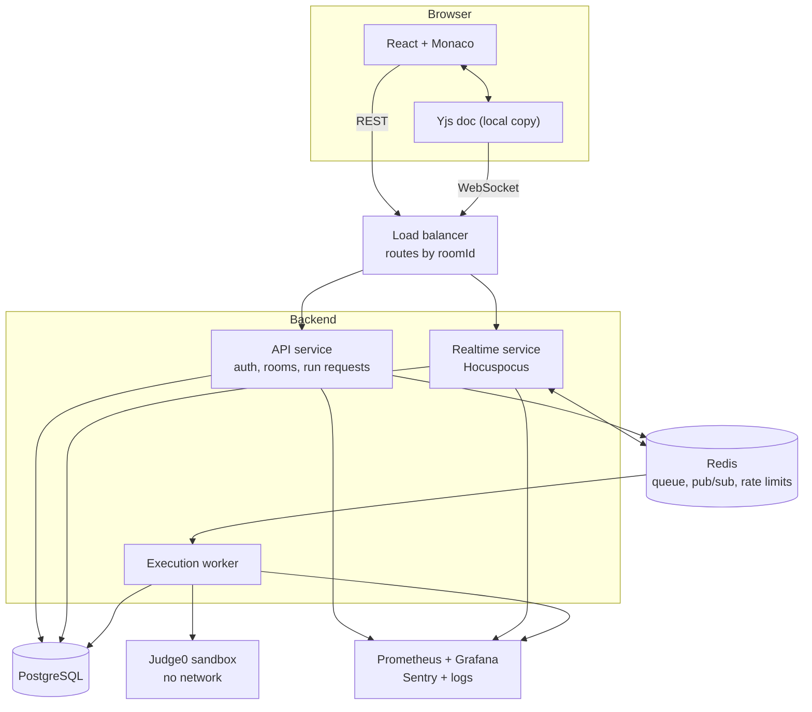
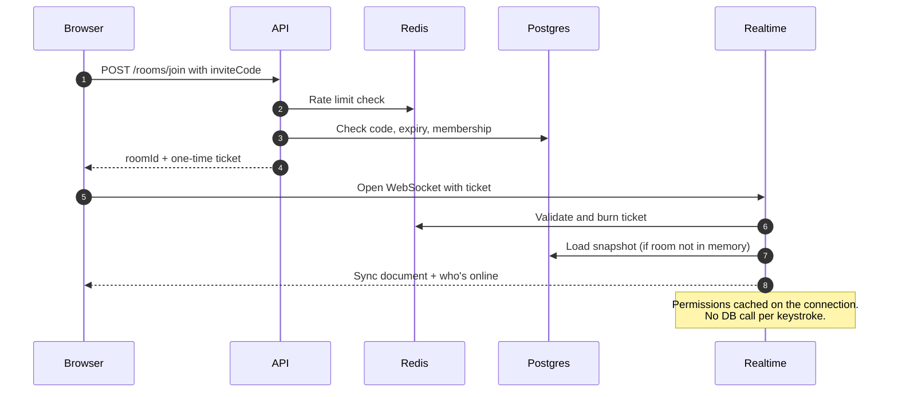
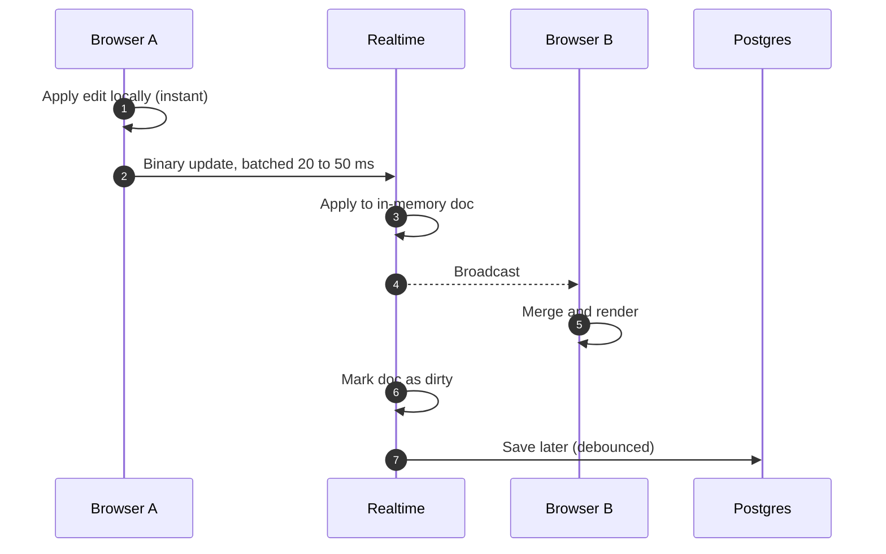
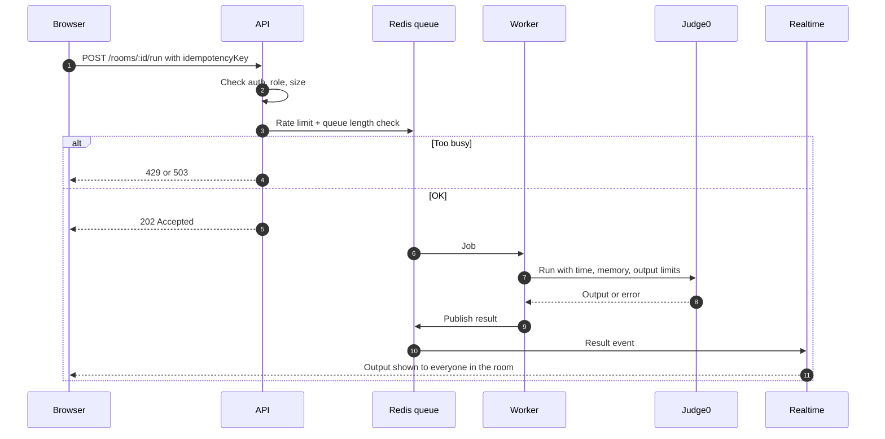

# PairDev: Design

A real-time pair programming app. Two or more people join a room, edit code together, run it, and chat.

This doc covers what I'm building, how it fits together, and what happens when things go wrong. Numbers are targets for a portfolio-scale product. I'll replace them with measured values once I've load tested.

---

## 1. Scope

**In**
- Sign up, log in
- Create a room, share an invite link, join
- Live shared editing with cursors and presence
- Chat in the room
- Run code, everyone sees the output
- Code persists, so you can come back

**Later**
- Roles (owner, editor, viewer)
- Interview mode (timer, read-only viewer)
- Voice/video
- Session replay
- AI helper

**Out (on purpose)**
- Multi-region deployment
- Multi-file projects
- Code that can access the network
- Mobile app

**Assumptions**
- Users are mostly in India, so one region (Mumbai)
- Target: 1,000 concurrent rooms, about 2,500 live connections
- 2 to 10 people per room

---

## 2. Requirements

### What it must do
- Auth with hashed passwords and httpOnly cookies
- Invite links that expire and can be revoked
- Edits from different people merge without losing text
- Code runs in an isolated sandbox with limits
- Permissions are enforced on the server

### How well it must do it

| Area | Target |
|---|---|
| Your own typing | Instant (applied locally first) |
| Others see your edit | p95 under 150 ms |
| REST API | p95 under 200 ms |
| Joining a room | Editor usable in under 1.5 s |
| Code run | Wait in queue under 2 s, hard timeout 10 s |
| Uptime | 99.5% a month |
| Data loss on crash | Nothing, or at most the last ~2 s |
| Consistency | Everyone ends up with identical text |

---

## 3. Rough capacity math

- 1,000 rooms, one person typing in each, about 5 updates a second: **5,000 updates/s**
- Each update is around 100 bytes, so **under 1 MB/s** total
- Snapshots are 10 to 100 KB each, so 100k rooms fit in about 10 GB

**Takeaway:** raw data volume is small. The things that can actually hurt are:
- Number of open connections
- Blocking Node's event loop
- How often we write to the database
- Code execution load

---

## 4. Architecture



### Main decisions

- **API and realtime are separate services.**
  - They scale differently (short requests vs long-lived sockets)
  - Deploying the API shouldn't drop everyone's connection
- **The live document sits in server memory.**
  - Keystrokes never wait on the database
  - This is the biggest latency win
- **Saving is async.**
  - Save a snapshot every ~30 s or N updates
  - Also save when a room empties and on shutdown
- **Same room, same server.**
  - Route by `roomId` so merging happens in one place
  - Redis syncs instances if we run more than one
- **Code never runs on my servers.**
  - API queues a job, a worker sends it to Judge0
- **Postgres over MongoDB.**
  - The data is relational, and most job posts ask for SQL
- **Realtime needs an always-on host** (Render, Railway, Fly.io).
  - Vercel serverless can't hold WebSockets, so it only serves the frontend

### Tech stack

| Layer | Choice |
|---|---|
| Frontend | React, TypeScript, Vite, Monaco |
| Sync | Yjs (CRDT) |
| Realtime server | Hocuspocus |
| API | Node, Express, TypeScript, Zod |
| Database | PostgreSQL |
| Queue and cache | Redis, BullMQ |
| Sandbox | Judge0 |
| Monitoring | Prometheus, Grafana, Sentry, pino |
| Testing | Vitest, Supertest, Playwright, k6 |

---

## 5. Data model

```
User       id, email, password_hash, name, created_at
Room       id, owner_id, name, language, invite_code, invite_expires_at
Member     room_id, user_id, role (owner | editor | viewer)
Message    id, room_id, user_id, text, created_at
Snapshot   room_id, yjs_state (binary), updated_at
Execution  id, room_id, user_id, language, status, stdout, stderr, created_at
```

**Indexes to add from day one**
- `Room(invite_code)` unique
- `Member(room_id, user_id)` unique
- `Message(room_id, created_at)`
- `Execution(room_id, created_at)`

---

## 6. Key flows

### Joining a room



### Typing (the fast path)



Nothing on this path touches the database or does a permission lookup.

### Running code



---

## 7. Making it fast

- Edits apply locally first, so typing never waits on the network
- Binary WebSocket messages, not JSON
- Batch outgoing updates over 20 to 50 ms
- Throttle cursor updates to 10 to 20 a second
- Host near users, with no cold starts on realtime
- Keep the Node event loop free
  - No heavy CPU work on the realtime process
  - Password hashing happens in the API only
- Cache room and permission info in memory per connection

---

## 8. What if...

### Network and servers

| What if | What happens |
|---|---|
| A user's network drops | Yjs keeps their edits locally and merges on reconnect. Retry with backoff plus jitter. |
| Realtime server crashes | Clients still have the full doc, reconnect, and re-sync. At worst we lose edits since the last save. |
| Everyone reconnects after a deploy | Graceful shutdown: stop new connections, save docs, close sockets. Clients reconnect with random delays. |
| Zombie connections | Ping every ~25 s, drop after missed replies |
| A slow client can't keep up | Drop cursor updates first, disconnect if the buffer keeps growing |
| Two servers claim the same room | Redis lease with a TTL, plus routing by `roomId` |

### Dependencies

| What if | What happens |
|---|---|
| Redis is down | Editing continues. Run requests fail fast with a 503. |
| Postgres is down | Editing continues from memory. Saves retry with backoff. REST returns 503. |
| Judge0 is slow or dead | Job timeouts, limited retries, dead-letter queue, max queue length |

### Abuse and security

| What if | What happens |
|---|---|
| Malicious code | Sandbox: no network, CPU, memory and process limits, output cap, time limit |
| Someone pastes 500 MB | WebSocket max payload, 1 MB doc cap, per-update size cap |
| Event spam | Per-user and per-IP rate limits (Redis), disconnect repeat offenders |
| Removed member still connected | Removal publishes an event and the server closes their socket |
| Token expires mid-session | Short-lived access token, refresh flow, socket re-checked on refresh |
| Invite link guessing | Long random codes (nanoid), expiry, rate limits, revocation |
| Double-clicked Run | Idempotency key returns the same result |
| Huge room | Room size cap, viewers are read-only, cursor fan-out throttled |

### Deploys

- Migrations are backward compatible: add first, backfill, remove later
- Old and new versions of the app must both work during a deploy

---

## 9. Monitoring

Track four things: **latency, traffic, errors, saturation.**

**Tools:** `prom-client` in each service, Prometheus, Grafana, Sentry, pino logs, and an uptime monitor on `/health`.

### Users and traffic
- `ws_connections` (gauge)
- `active_rooms` (gauge)
- Counters: signups, logins, rooms created, runs
- DAU and MAU: log events like `user_active` and query them daily (PostHog or a plain table). Don't derive these from Prometheus.

### Latency
- HTTP duration histogram per route, for p50, p95 and p99
- **Edit propagation time**, the metric that matters most
  - A probe script opens two clients in one process
  - Client A writes a timestamped marker, client B sees it
  - The difference is recorded, once a minute
  - Same process means no clock-skew problems
- Queue wait time and run duration

### Health
- 5xx rate, disconnect reasons, reconnect rate
- Queue depth, failed runs, dead-letter count
- **Event-loop lag**, the best early warning for an overloaded realtime server
- CPU, memory, GC
- Flush duration and number of unsaved docs
- Postgres and Redis latency and connection counts

### Rules
- Never use `userId` or `roomId` as a metric label. Put them in logs.
- Every log line carries a `requestId` and `roomId`
- Alert on user-facing symptoms, not every CPU spike:
  - p95 edit latency over 150 ms for 5 minutes
  - Error rate over 2%
  - Queue depth growing

### Dashboards
1. Users: connections, rooms, DAU
2. Latency and errors
3. Run pipeline: queue depth, wait time, failures

---

## 10. Proving it works

| Claim | Test |
|---|---|
| Edits converge | Playwright: two browsers type at once, assert same text |
| Survives disconnects | Same test, go offline and back mid-typing |
| Crash recovery | Kill the realtime process mid-session, check nothing is lost |
| Latency target | Edit-propagation probe plus k6 at 500, 1,000 and 2,500 connections |
| Sandbox is safe | Run `while(true){}`, a fork bomb, a giant print loop, a network call |
| Permissions hold | Viewer write is rejected, removed member is disconnected |
| Deploys are smooth | Deploy during a load test, no drops beyond a reconnect blip |
| Rate limits work | Exceed limits, expect 429 |

Load test results (p95 at each level) go in the README once measured.

---

## 11. Build order

| Phase | What |
|---|---|
| 0 | Auth, rooms API, deploy |
| 1 | WebSockets, presence, chat |
| 2 | Naive editor sync (write down what breaks) |
| 3 | Yjs and Hocuspocus, live cursors, persistence |
| 4 | Code execution: queue, Judge0, limits |
| 5 | Roles, interview mode, optional voice/video |
| 6 | Hardening: Docker, CI, tests, monitoring, load tests |

Each phase ends with something deployed and working.

---

## 12. Open questions

- One Hocuspocus instance or several? Start with one, add Redis sync when load tests say so.
- Hosted Judge0 or self-hosted? Hosted first, self-host if cost or limits bite.
- Store chat in Postgres or inside the Yjs doc? Postgres for now, simpler to query.
